# Frontend Harness Slides

**[中文说明](README.zh-CN.md)**

Build HTML slide decks with a frontend harness, so the deck can survive real
iteration.

A single-file HTML deck is fine for a quick draft. It gets painful when the deck
grows, when one slide needs careful tuning, or when a small CSS, animation, or
layout change quietly breaks another page. This skill is built for that later
phase.

The main advantage is not just prettier slides. The harness treats the deck as a
small, testable web app: scenes are addressable, interactions are isolated,
screenshots are repeatable, and the final deck can ship as a live site, a PDF,
or both.

## Live preview

> 🖥️ Try the live Vercel Workbench:
> [dynamic style preset preview](https://frontend-harness-slides-demo.vercel.app/).
> It is the fastest way to see the motion, density, and visual range before
> reading the full catalog.

## Why the harness matters

Most slide generators can produce an attractive first version. The harder part
is keeping a larger deck stable after feedback. `frontend-harness-slides` puts a
small engineering frame around the deck:

- stable scene and beat addresses, so any frame can be opened directly;
- a registry, so tooling can enumerate the deck without scraping visible text;
- a fixed-ratio stage, so slide content stays inside the canvas;
- frozen mode, so screenshots and visual checks are repeatable;
- event-isolated interactions, so clicks, drags, inputs, and tooltips do not
  leak into global navigation;
- meaningful tests and smoke checks, so missing content, overflow, runtime
  errors, and navigation leaks are caught before handoff.

Visual style still matters. The difference is that the style sits on top of a
deck structure that is designed to be edited, tested, deployed, and exported.

## What it is good for

- Speaker-led talks that need motion, pacing, and interactive beats.
- Product walkthroughs, teaching decks, and technical explainers.
- High-control slide work where later edits should not quietly damage other
  pages.
- Decks that need both a local preview and a real delivery path, such as online
  deployment or PDF export.

For a tiny one-off static slide, a single HTML file is usually enough. This
skill is for decks where design quality, iteration, and verification matter.

## Model choice

For visual slide work, model taste matters. I usually recommend starting with
Gemini for stronger frontend aesthetics, then Claude. GPT 5.5 can work too, and
this skill includes guidance that helps it produce better visual results, but in
my own trials it still tends to need more direction than Gemini.

## Visual style gallery

> 📚 Browse all style presets: [Style catalog](references/style/preview.md)

The style system is designed to stay coherent without forcing every page into
the same template. A deck can keep one visual language while changing layouts,
beats, motion, and interaction patterns from scene to scene.

The full catalog contains style presets across speaker-led, hybrid, and dense
reading formats. These six examples show the range.

### Minimal keynote

#### [Style 06: Blackboard chalk talk](references/style/minimal-keynote.md#style-06-blackboard-chalk-talk)

Handmade, educational, and reasoning-first. Uses chalk-drawn lines and formulas
on a deep green board.

<p align="center">
  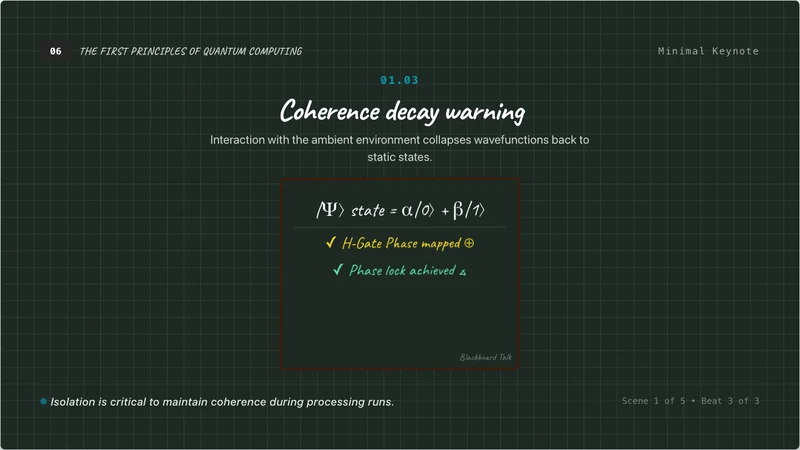
  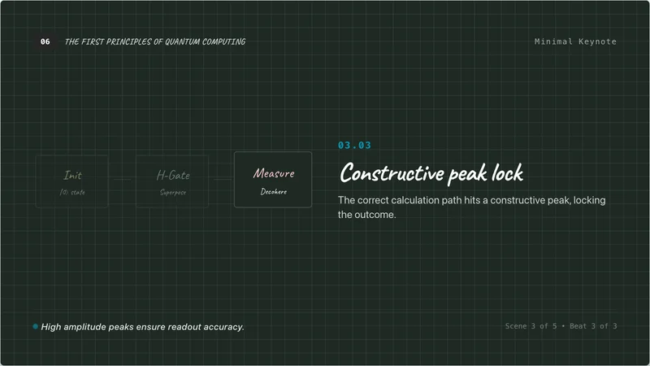
  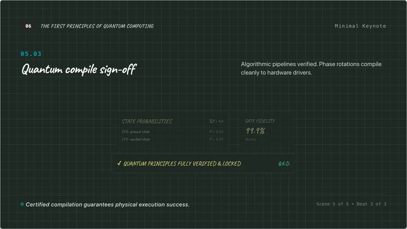
</p>

#### [Style 02: Sketch board emoji](references/style/minimal-keynote.md#style-02-sketch-board-emoji)

Warm, approachable, and human-in-the-loop. Uses sticky notes, tape, emoji actors,
and small interactive details.

<p align="center">
  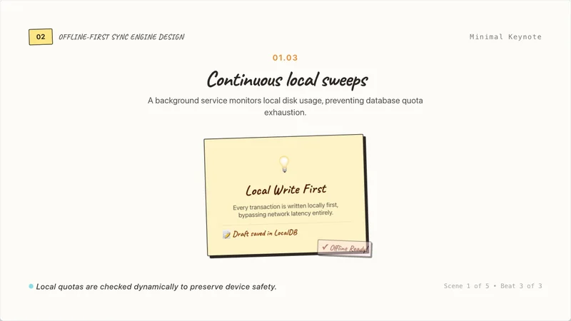
  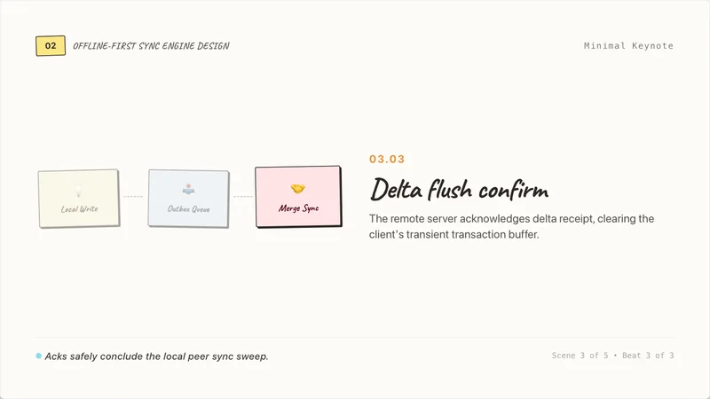
  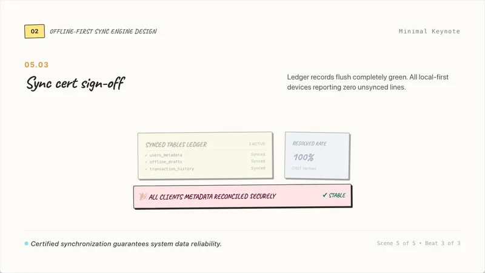
</p>

### Balanced hybrid

#### [Style 13: Subway map of intent](references/style/balanced-hybrid.md#style-13-transit-flow-subway-map)

Systematic and structured. Represents converging workflows as subway lines and
transfer stations.

<p align="center">
  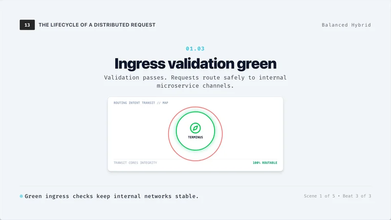
  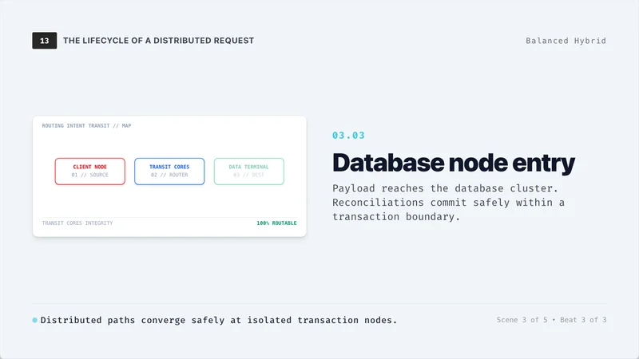
  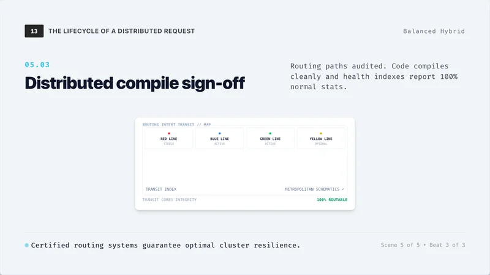
</p>

#### [Style 16: Debug reaction board](references/style/balanced-hybrid.md#style-16-diagnostic-kanban-board)

Developer-native and diagnostic. Uses neon status badges, terminal surfaces, and
actionable boards.

<p align="center">
  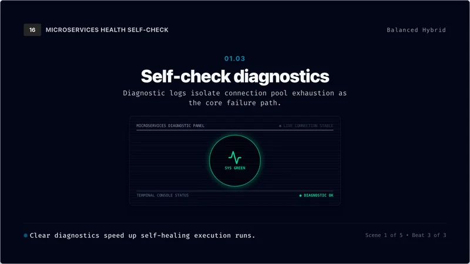
  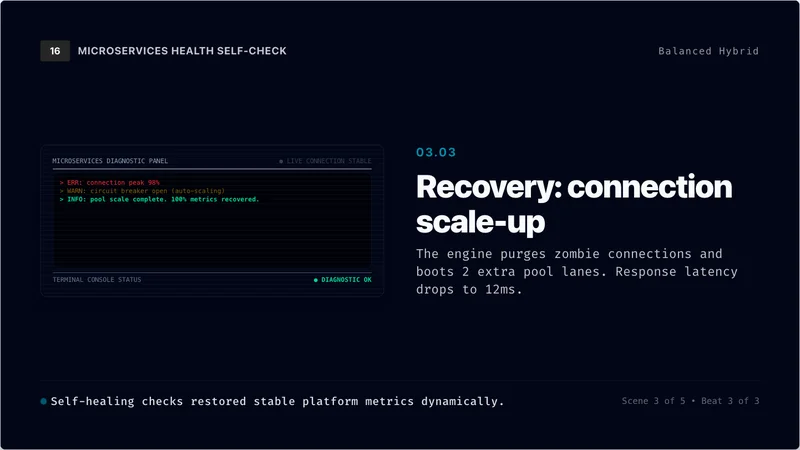
  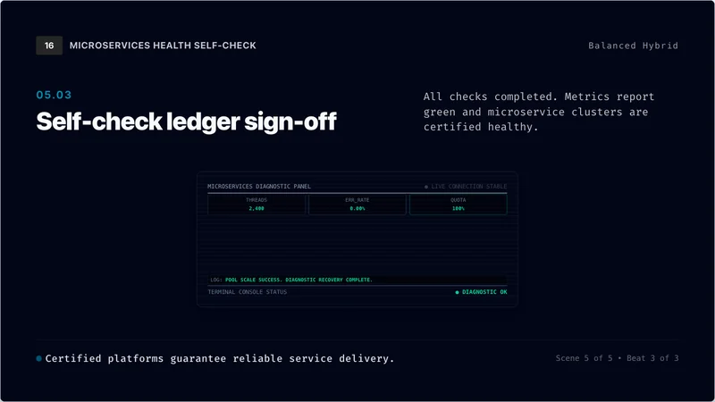
</p>

### Text report

#### [Style 18: Maintainer issue brief](references/style/text-report.md#style-18-developer-ticket-brief)

Clean, structured, and action-oriented. Inspired by modern issue trackers and
code review tools.

<p align="center">
  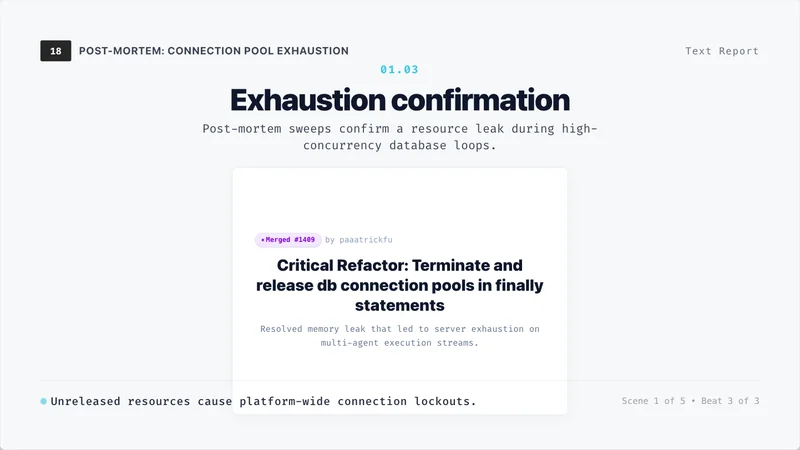
  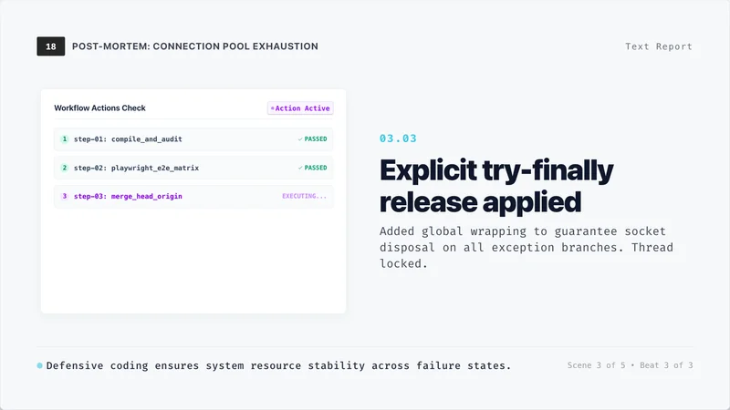
  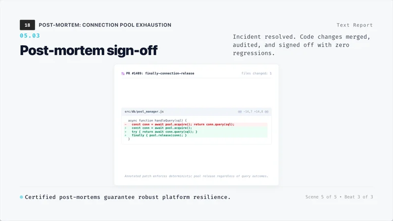
</p>

#### [Style 21: Field notes report](references/style/text-report.md#style-21-field-notes-report)

Tactile and observational. Uses ledger paper, charcoal ink, and card grids.

<p align="center">
  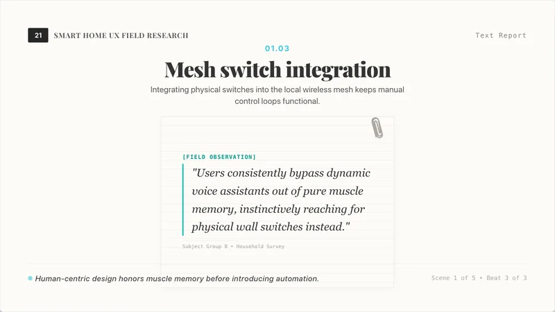
  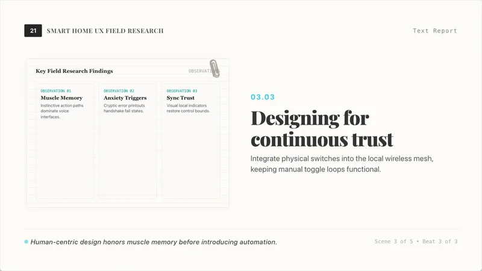
  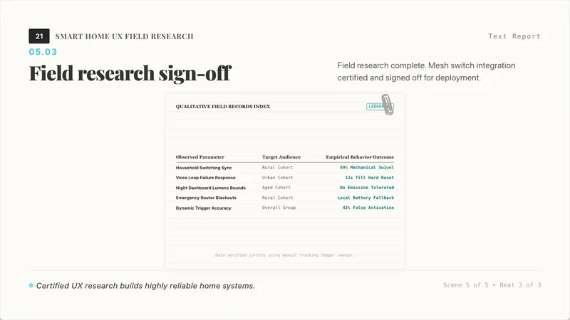
</p>

<p align="center">
  <a href="https://frontend-harness-slides-demo.vercel.app/"><b>🎬 Live demo</b></a>
  &nbsp;|&nbsp;
  <a href="references/style/preview.md"><b>📚 Browse all styles</b></a>
</p>

## Install

```bash
npx skills add patrick-fu/frontend-harness-slides -g
```

Update later:

```bash
npx skills update -g
```

## Typical workflow

1. Plan: align on content, audience, presentation format, style direction,
   technology, delivery target, and whether the user wants style previews first.
2. Design: choose a coherent style system, then vary layouts, motion, and
   interaction patterns across scenes.
3. Build: create stable slide scenes with keyboard navigation, interactive
   elements, repeatable previews, and tests that protect future edits.
4. Verify and ship: run meaningful layout and interaction checks, inspect
   screenshots, preview locally, then deploy online, export PDF, or do both.

## More curated skills

Browse my curated collection of practical agent skills:
[Awesome Skills](https://github.com/patrick-fu/awesome-skills).
