# Full Style Preview Guide

This guide provides a comprehensive visual catalog of all 24 styles in our design system. Each style is presented with a **3-image horizontal progression** illustrating its layout versatility across three information density levels:

1.  **Low Density (Opener / Hero)**: Minimalist, high-impact statement or cover page.
2.  **Medium Density (Flow / Timeline)**: Process, chronological sequence, or logical progression.
3.  **High Density (Bento / Grid / Data)**: Multi-category card layout, detailed metrics, or code diffs.

All screenshots are optimized as lightweight WebP images at 540p resolution to ensure fast loading times.

---

## 🟢 Minimal Keynote (Styles 01 - 08)

Minimal Keynote styles are sparse, high-impact, and presentation-led. Perfect for live speaking, big statements, and section openings.

### Style 01: Minimal Product Keynote
*A premium, highly focused product keynote screen. It uses extreme whitespace, a single high-fidelity central object, and dramatic typographic scale to convey quiet confidence.*
*   **Topic**: *Quantum Compiler Architecture*

  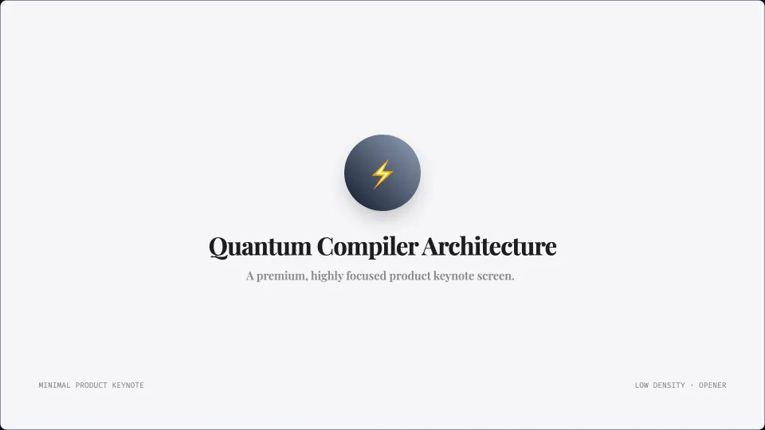
  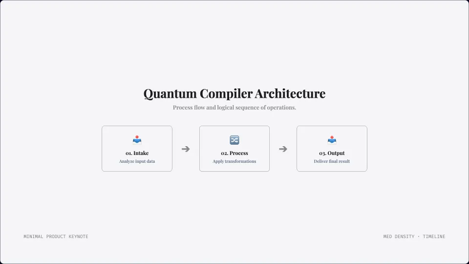
  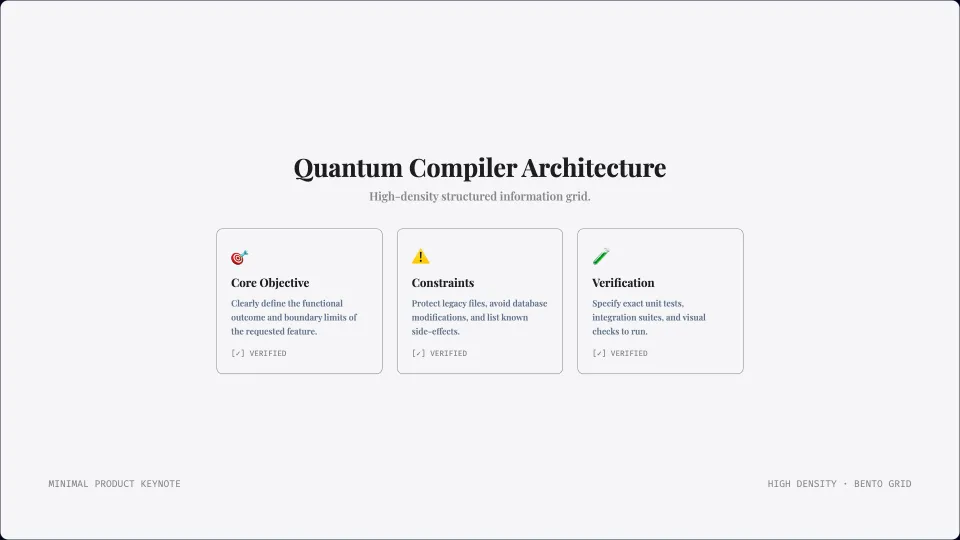

*   **Design DNA Tokens**:
    *   **Canvas**: Off-white (`#f5f5f7`) or deep space black (`#1d1d1f`).
    *   **Ink**: High-contrast black (`#1d1d1f`) or pure white (`#ffffff`).
    *   **Accent**: Sparingly used vibrant teal or blue (less than 5% of canvas).
    *   **Typography**: Elegant serif display font paired with a clean sans-serif body.

---

### Style 02: Sketch Board Emoji
*Warm, approachable, and human-in-the-loop. Mimics a physical brainstorming session with hand-drawn lines, sticky notes, tape, and emoji actors.*
*   **Topic**: *Offline-First Sync Engine Design*

  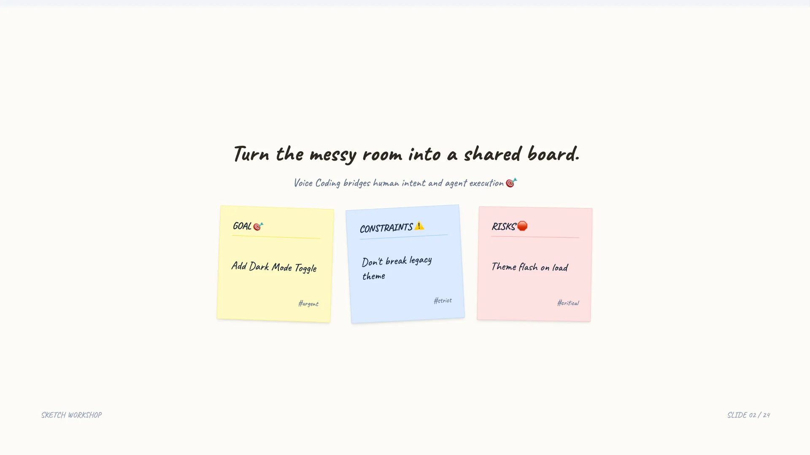
  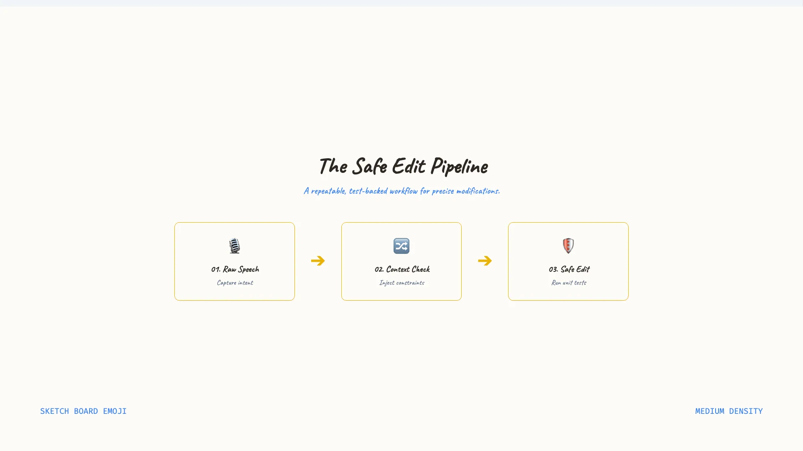
  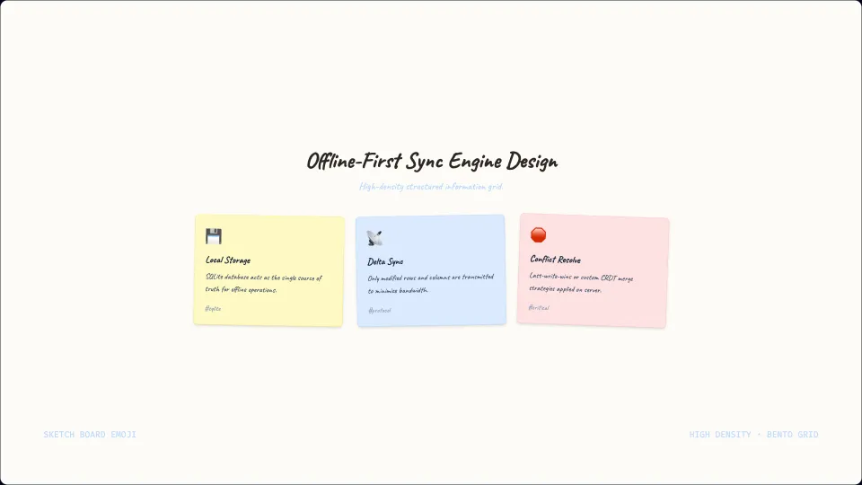

*   **Design DNA Tokens**:
    *   **Canvas**: Warm paper white (`#fcfbf7`) with a very light grid pattern.
    *   **Ink**: Charcoal black (`#2d2722`) for lines and text.
    *   **Accent**: Sticky-note yellow (`#fef08a`), tape blue (`#bfdbfe`), risk red (`#fecaca`).
    *   **Typography**: Friendly handwriting font (e.g., Caveat) paired with sans-serif.

---

### Style 03: Interactive Dialogue Stage
*A tiny, dramatic theater scene or chat console where the interaction between two roles is staged. Focuses entirely on dialogue, questions, and responses.*
*   **Topic**: *Human-Agent Collaboration Handshake*

  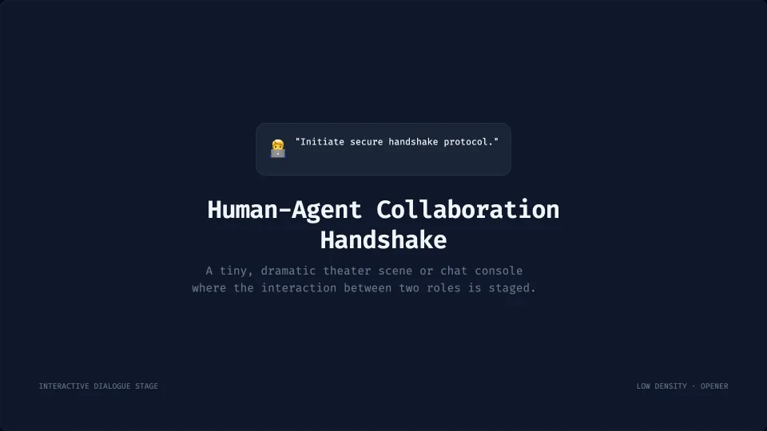
  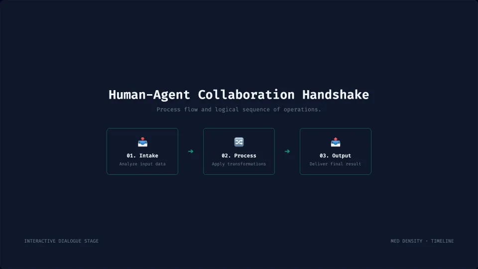
  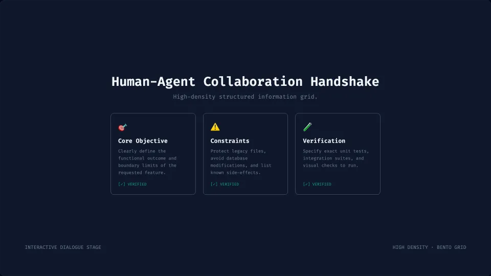

*   **Design DNA Tokens**:
    *   **Canvas**: Deep stage blue (`#0f172a` or `#0b0f19`).
    *   **Ink**: Crisp white for text, teal (`#0d9488`) or emerald (`#10b981`) for active speakers.
    *   **Accent**: Soft slate (`#64748b`) for background elements.
    *   **Typography**: Modern monospace (e.g., Fira Code) to emphasize digital structure.

---

### Style 04: Kinetic Type Punchline
*A bold, high-energy graphic poster. Uses stacked, massive, high-impact words to deliver a core claim with maximum graphic energy.*
*   **Topic**: *The Death of Boilerplate Code*

  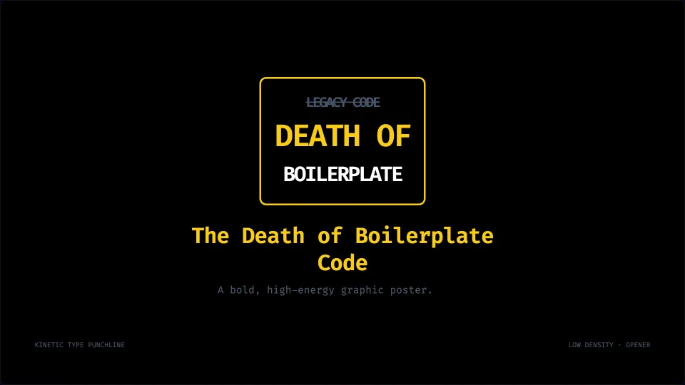
  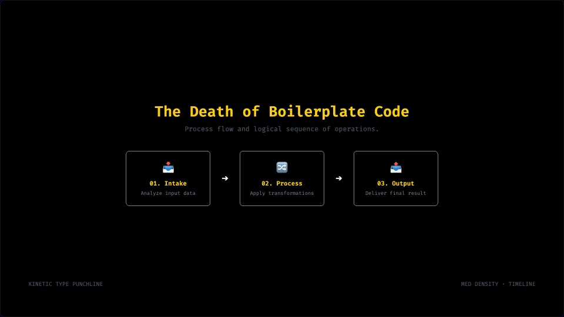
  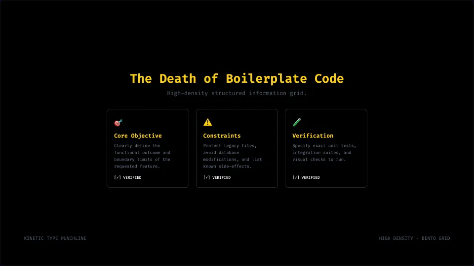

*   **Design DNA Tokens**:
    *   **Canvas**: Solid black (`#000000`) or high-saturation yellow (`#facc15`).
    *   **Ink**: Pure white, black, or neon yellow with extreme contrast.
    *   **Accent**: Muted gray for supporting details.
    *   **Typography**: Massive, extra-bold, condensed sans-serif (e.g., Inter Extra Bold).

---

### Style 05: Object Metaphor Hero
*A tactile, physical kit or package (like a field kit or a packed backpack). Represents the idea of structured preparation and carrying the right tools.*
*   **Topic**: *The Context-Driven Handoff Kit*

  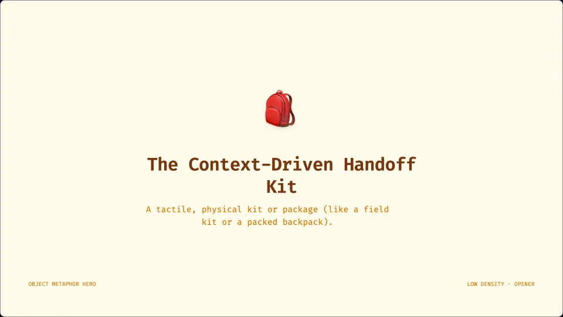
  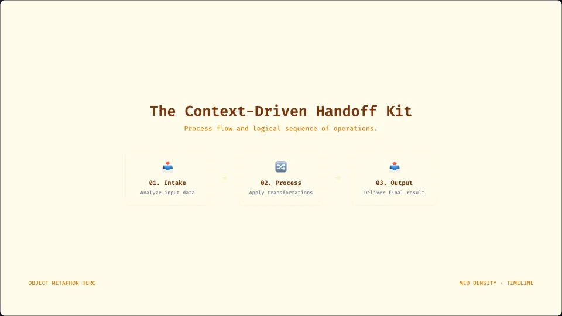
  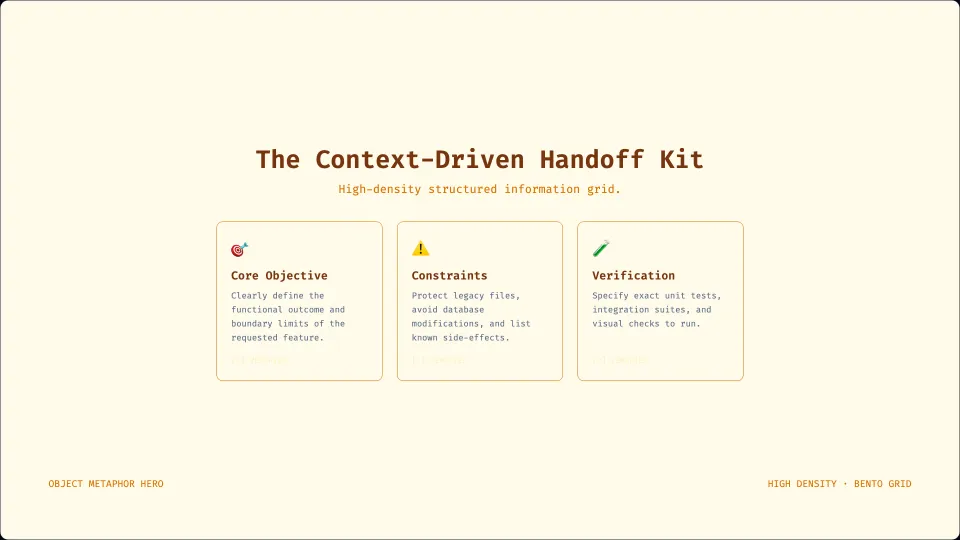

*   **Design DNA Tokens**:
    *   **Canvas**: Warm, textured cream (`#fffbeb`) or light sand.
    *   **Ink**: Rich amber (`#78350f`), dark brown, and warm gold.
    *   **Accent**: Soft olive green or terracotta.
    *   **Typography**: Clean sans-serif for labels, classic serif for headers.

---

### Style 06: Blackboard Chalk Talk
*A classroom or engineering blackboard where a teacher or engineer is actively proving a formula or drawing a conceptual diagram. Feels handmade and educational.*
*   **Topic**: *The First Principles of Quantum Computing*

  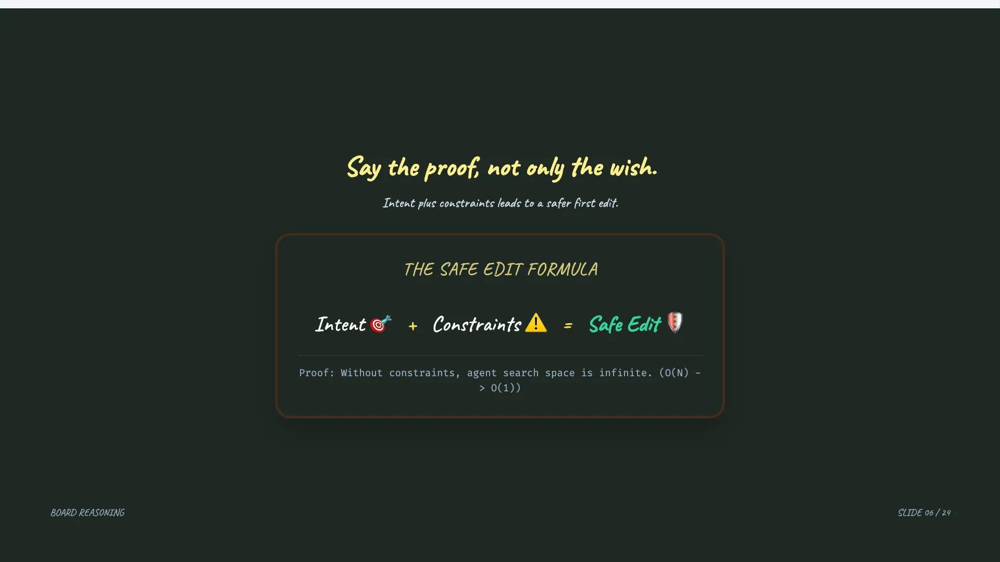
  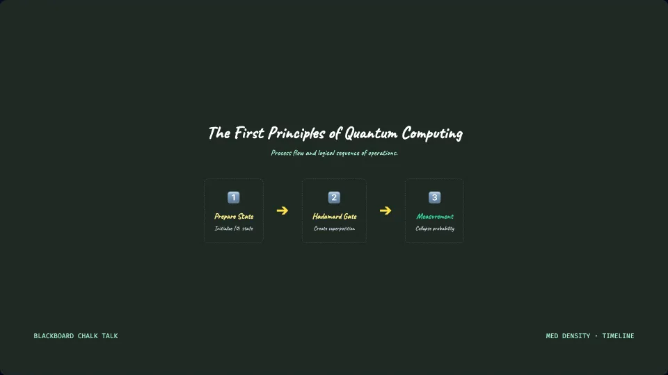
  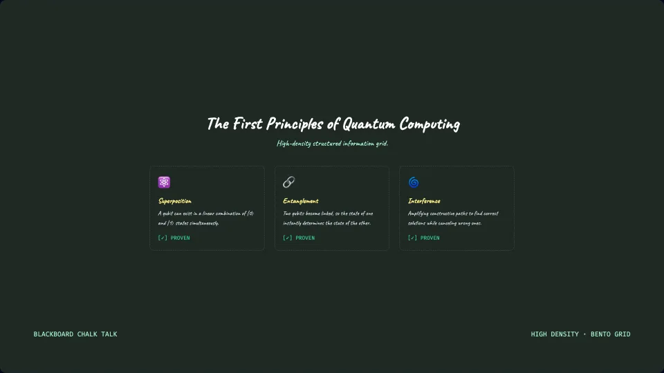

*   **Design DNA Tokens**:
    *   **Canvas**: Deep chalkboard green (`#1e2923`) or dark slate.
    *   **Ink**: Chalk white, pastel yellow (`#fef08a`), and soft mint green (`#a7f3d0`).
    *   **Accent**: Chalk-drawn lines and stroke textures.
    *   **Typography**: Thin, handwritten font (e.g., Caveat) paired with monospace.

---

### Style 07: Arcade Boss Fight
*A retro 8-bit arcade game screen. Frames technical challenges as a "boss fight" and preparation as "collecting power-ups" to make risks engaging.*
*   **Topic**: *Legacy Codebase Refactoring Boss*

  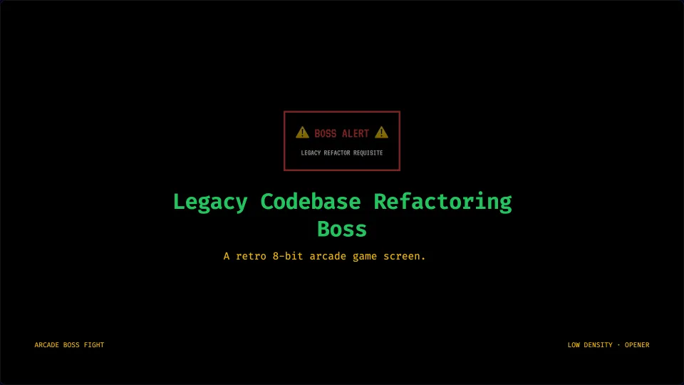
  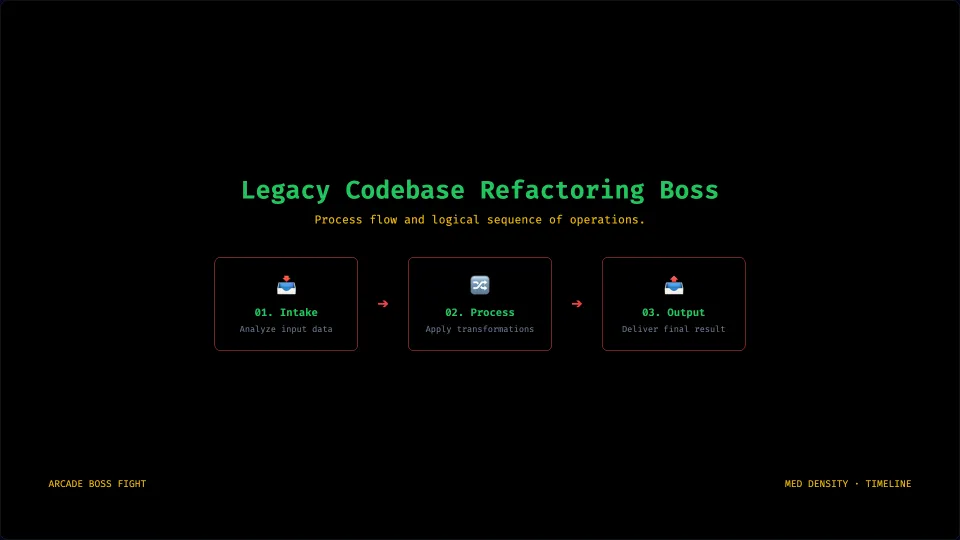
  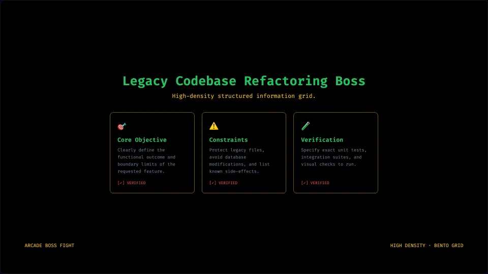

*   **Design DNA Tokens**:
    *   **Canvas**: Pure black (`#000000`).
    *   **Ink**: Neon green (`#22c55e`), vibrant red (`#ef4444`), and arcade yellow (`#eab308`).
    *   **Accent**: Retro pixel borders and status bars.
    *   **Typography**: Pixelated arcade fonts (e.g., Press Start 2P, VT323).

---

### Style 08: Spotlight Quote Poster
*A theatrical stage where a single spotlight shines on a powerful quote. Designed to create a dramatic pause for emotional resonance.*
*   **Topic**: *The Philosophy of Clean Code*

  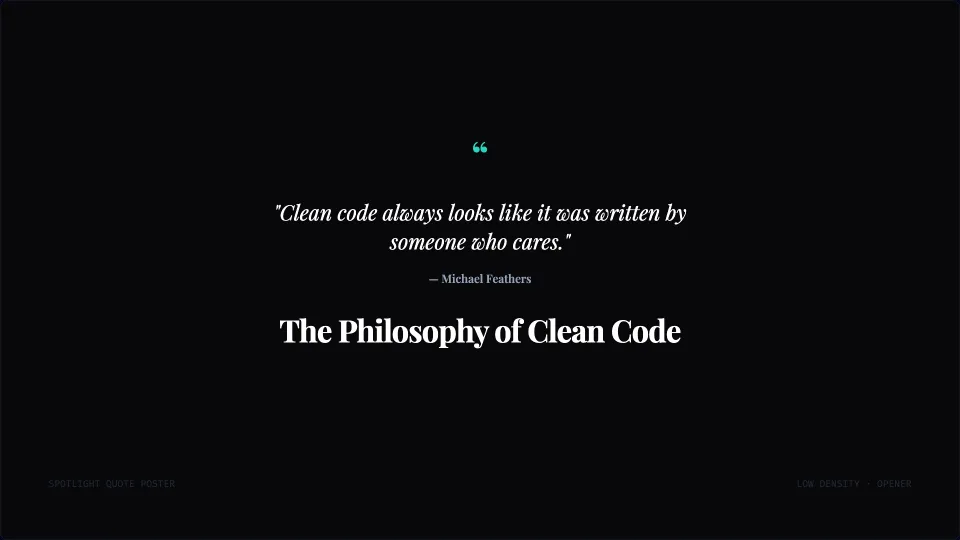
  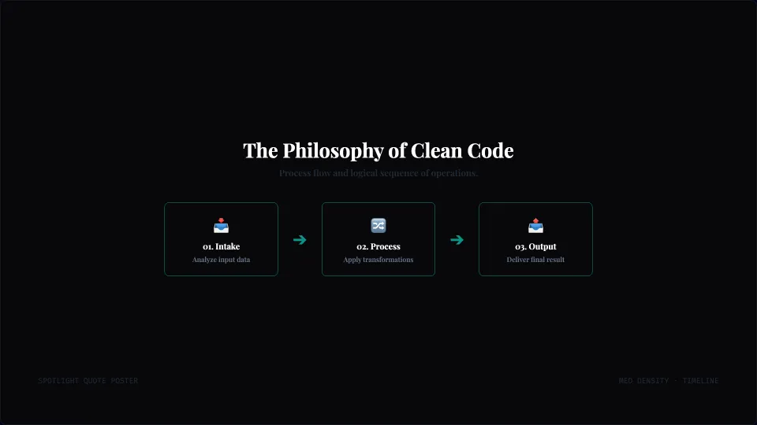
  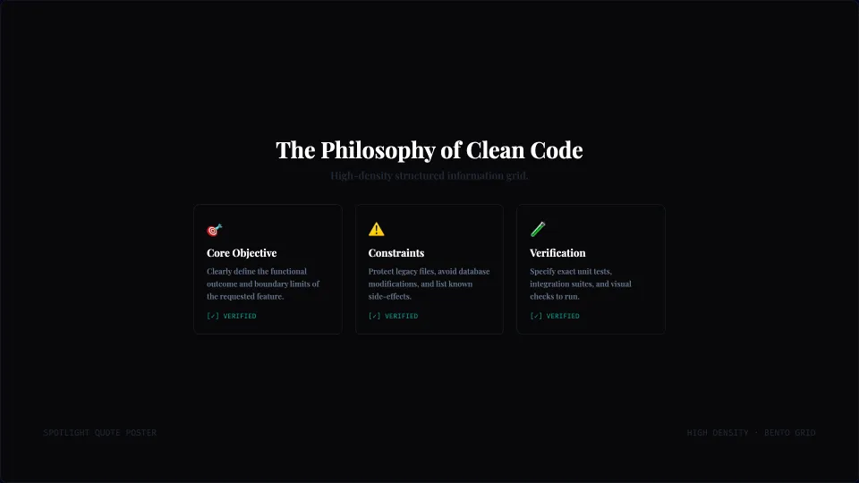

*   **Design DNA Tokens**:
    *   **Canvas**: Deep, dark charcoal or pure black (`#08080a`) with a radial spotlight gradient.
    *   **Ink**: Pure white for the quote text.
    *   **Accent**: Muted, elegant teal (`#0d9488`) for the author's name.
    *   **Typography**: Large, elegant, italicized serif display font (e.g., Playfair Display Italic).

---

## 🟡 Balanced Hybrid (Styles 09 - 16)

Balanced Hybrid styles support both live presenting and later reading. They are graphic, structured, and highly versatile.

### Style 09: Signal Pipeline Flow
*A highly structured signal pipeline. It shows data entering from the left, passing through processing nodes with glowing indicators, and exiting on the right.*
*   **Topic**: *CI/CD Compilation Pipeline*

  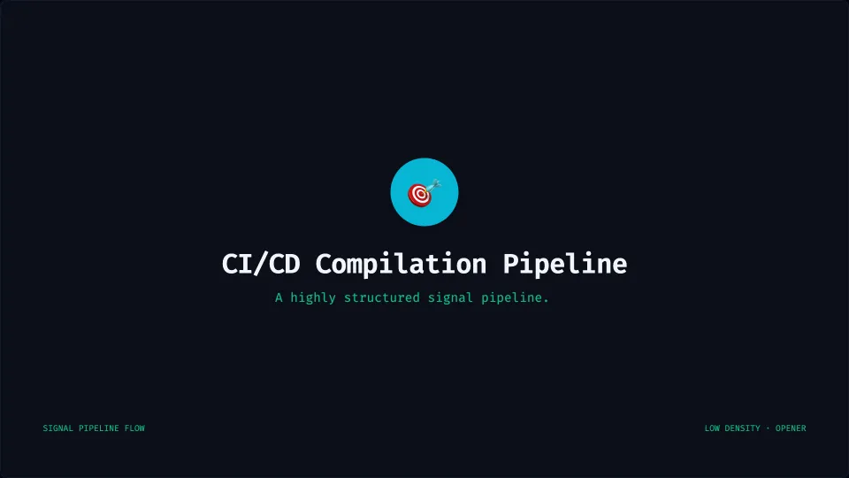
  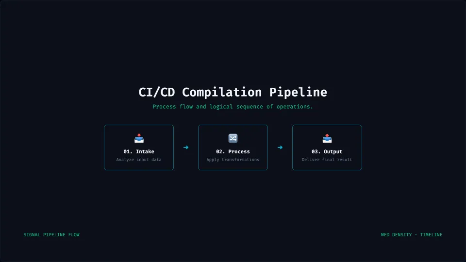
  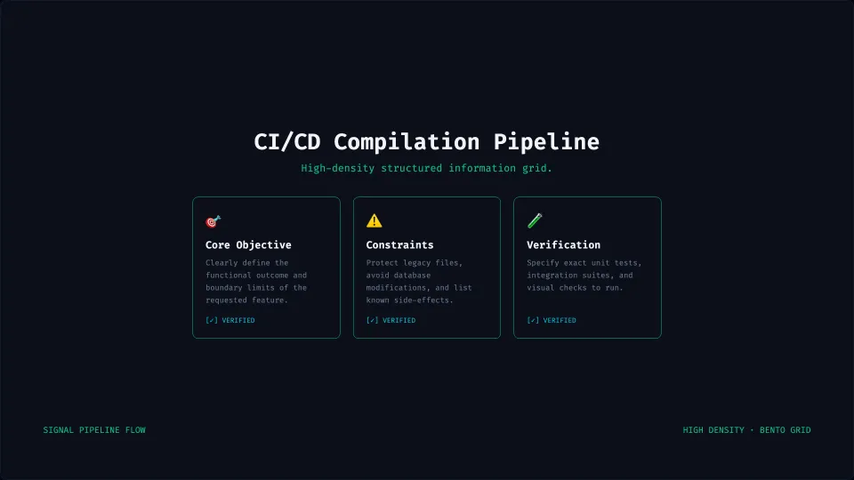

*   **Design DNA Tokens**:
    *   **Canvas**: Deep, dark terminal black (`#0b0f19` or `#0f172a`).
    *   **Ink**: Muted grays, with glowing neon blue (`#06b6d4`) and emerald (`#10b981`) for active signals.
    *   **Accent**: Thin, precise connecting lines (`rgba(255,255,255,0.08)`).
    *   **Typography**: Crisp, compact monospace for technical labels.

---

### Style 10: Mechanical Scoring Funnel
*An engineering scoring funnel or sieve. It shows raw, noisy data entering a wide funnel, passing through filter meshes, and emerging as highly refined results.*
*   **Topic**: *AST-Based Code Refactoring Sieve*

  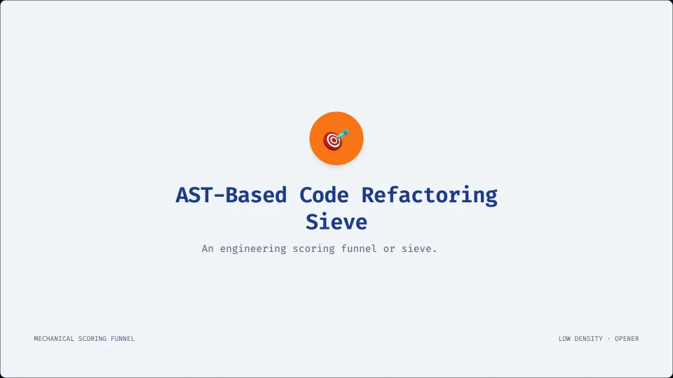
  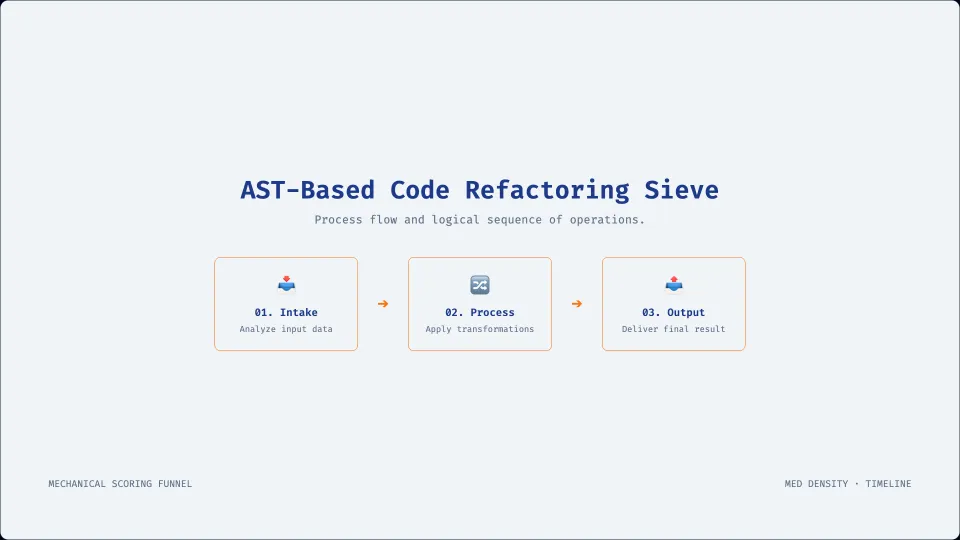
  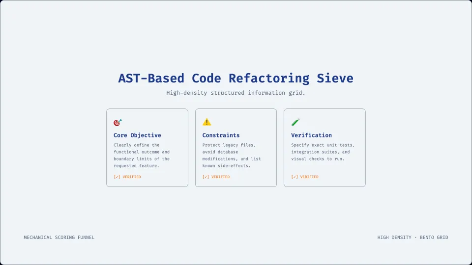

*   **Design DNA Tokens**:
    *   **Canvas**: Light, clean technical blueprint blue (`#f0f4f8` or `#e6f0fa`).
    *   **Ink**: Deep blueprint blue (`#1e3a8a`) for structure and text.
    *   **Accent**: High-visibility orange (`#f97316`) or red for filter thresholds.
    *   **Typography**: Clean, geometric sans-serif (e.g., Inter).

---

### Style 11: Collaborative Pairing Board
*A clean, digital whiteboard where two distinct entities (e.g., human and AI) are pairing and collaborating. Focuses on division of labor and synchronization.*
*   **Topic**: *Human-AI Pair Programming Workflow*

  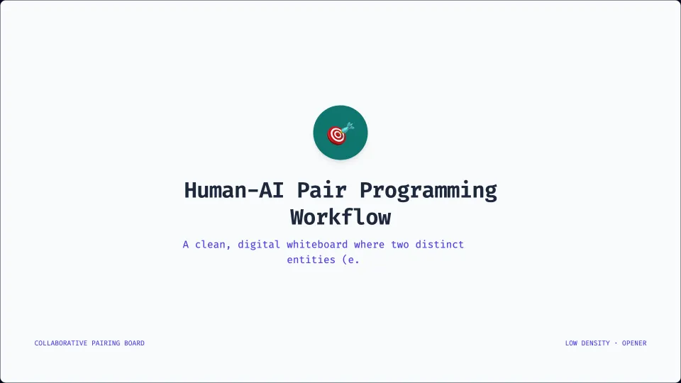
  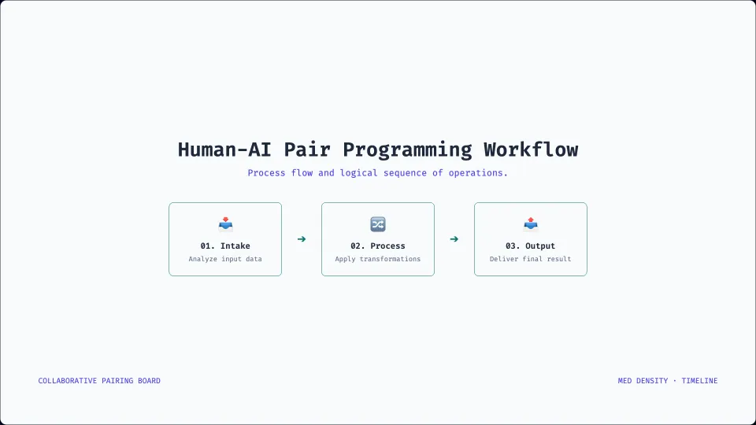
  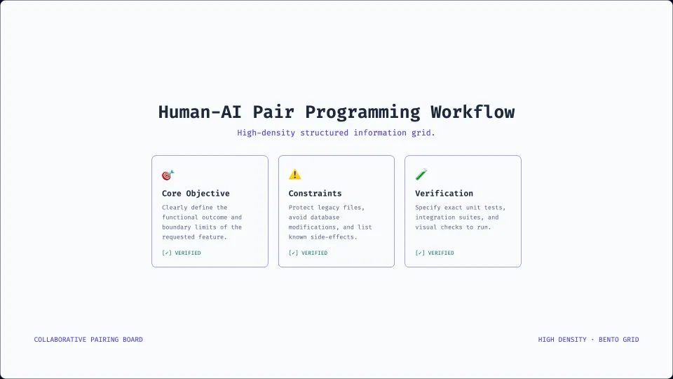

*   **Design DNA Tokens**:
    *   **Canvas**: Clean, light gray (`#f8fafc`) or pure white (`#ffffff`).
    *   **Ink**: Deep slate (`#1e293b`) for text.
    *   **Accent**: Calm, professional teal (`#0f766e`) or indigo (`#4f46e5`).
    *   **Typography**: Clean, modern sans-serif paired with monospace labels.

---

### Style 12: Studio Mixing Console
*A professional audio mixing console or studio dashboard. Turns parameter tuning, noise filtering, and signal balancing into physical faders and LED meters.*
*   **Topic**: *LLM Hyperparameter Fine-Tuning*

  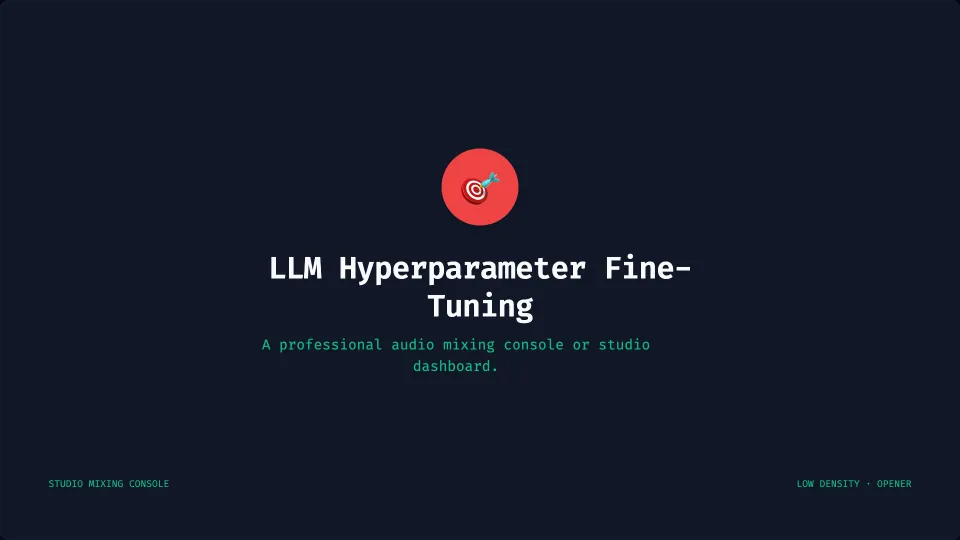
  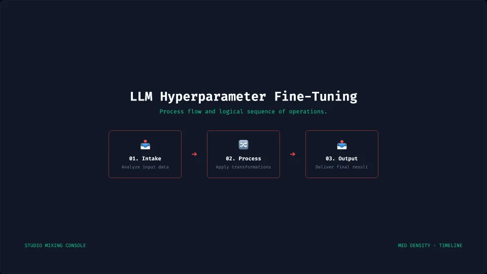
  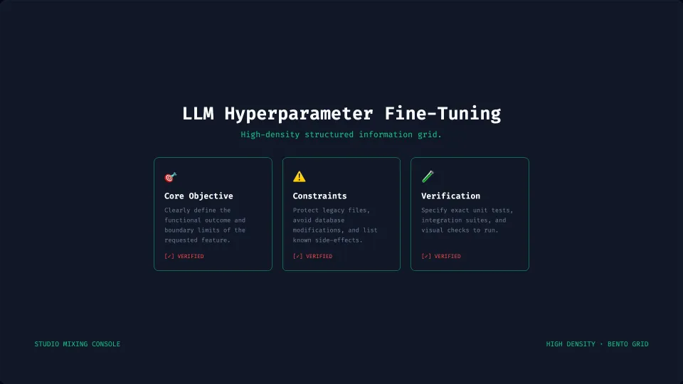

*   **Design DNA Tokens**:
    *   **Canvas**: Deep, studio black (`#111827` or `#1f2937`).
    *   **Ink**: Metallic grays, with vibrant red (`#ef4444`), green (`#10b981`), and amber (`#f59e0b`).
    *   **Accent**: Glowing LED level indicators.
    *   **Typography**: Compact monospace to mimic hardware labels.

---

### Style 13: Subway Map of Intent
*A clean, systematic transit or subway map. Represents the idea that multiple independent streams of intent, constraints, and data converge at key "transfer stations".*
*   **Topic**: *The Lifecycle of a Distributed Request*

  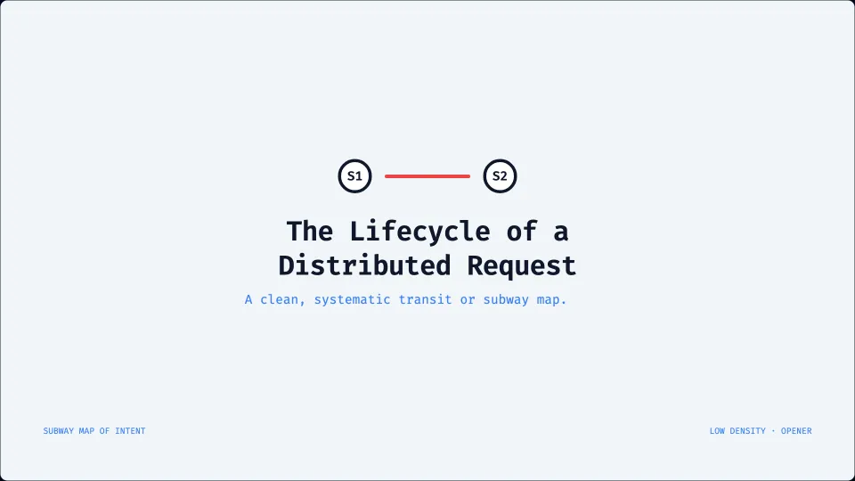
  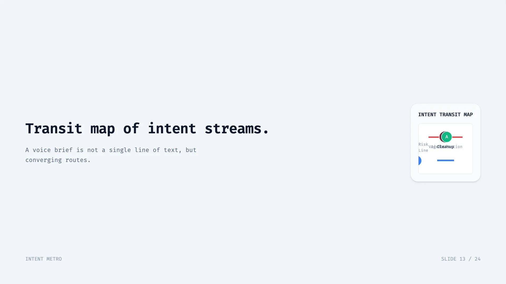
  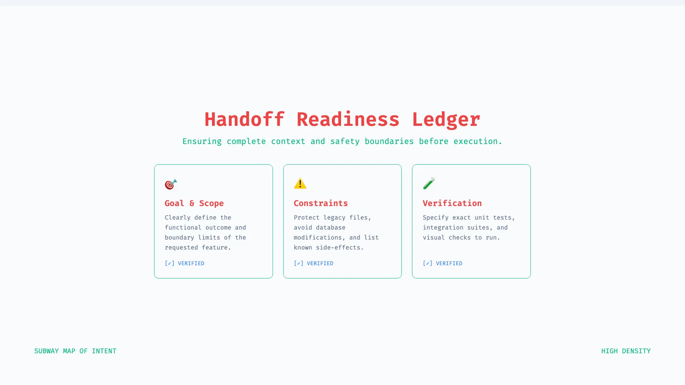

*   **Design DNA Tokens**:
    *   **Canvas**: Light, clean public-info gray (`#f1f5f9` or Tailwind `bg-slate-100`).
    *   **Ink**: Distinct transit line colors (Red `#ef4444`, Blue `#3b82f6`, Green `#10b981`).
    *   **Accent**: Dark slate for text and transfer station circles.
    *   **Typography**: Highly legible, clean sans-serif (e.g., Inter).

---

### Style 14: Kitchen Prep Station
*A warm, professional kitchen prep station. Treats raw, messy input data as "raw ingredients" and the preparation process as "chopping, trimming, and plating".*
*   **Topic**: *Raw Text Pre-processing & Tokenization*

  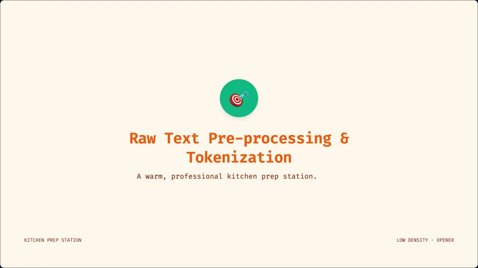
  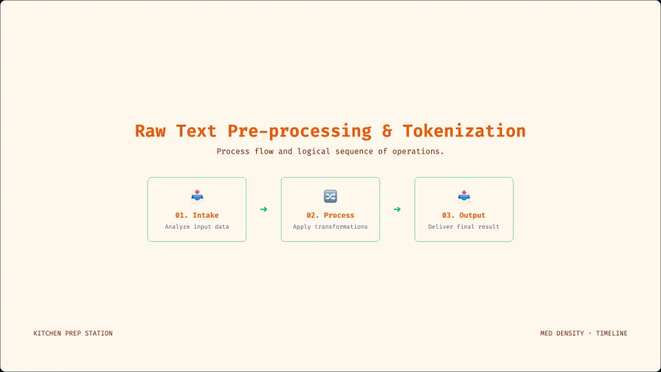
  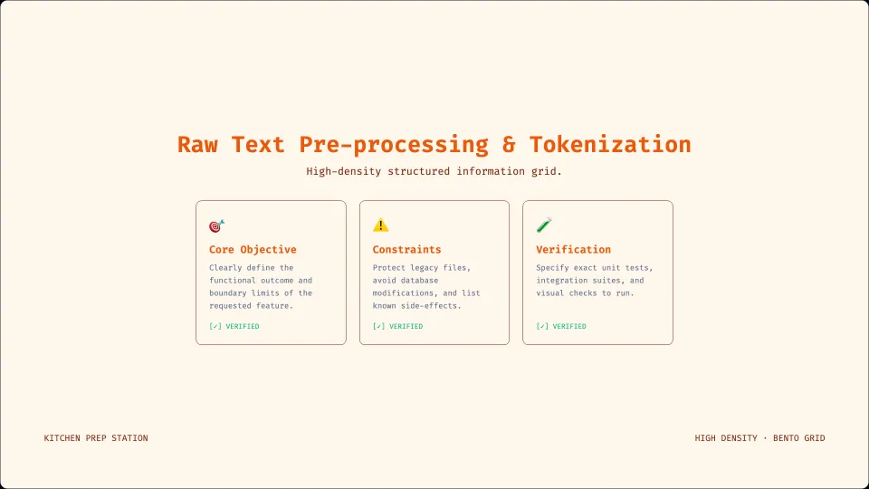

*   **Design DNA Tokens**:
    *   **Canvas**: Soft, warm orange-tinted cream (`#fff7ed`).
    *   **Ink**: Rich terracotta orange (`#ea580c`), warm wood browns, and fresh herb green (`#10b981`).
    *   **Accent**: Playful food or utensil emojis.
    *   **Typography**: Friendly, rounded sans-serif or warm serif.

---

### Style 15: Context Bento Box
*A traditional Japanese bento box. Represents the idea that a high-quality handoff or prompt must have distinct, compartmentalized, color-coded sections.*
*   **Topic**: *Modern AI Agent Platform Architecture*

  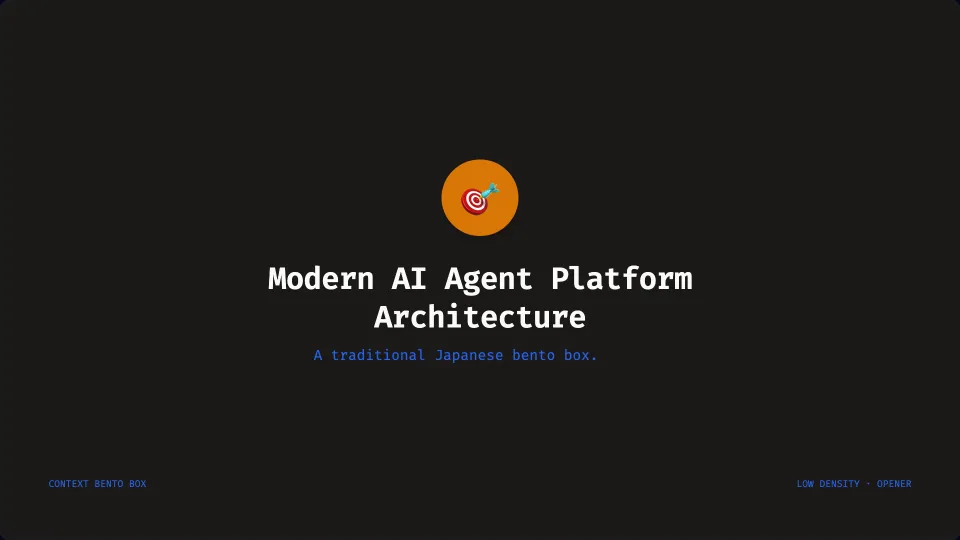
  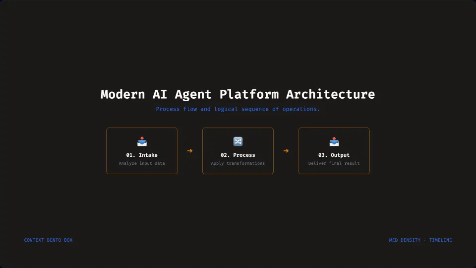
  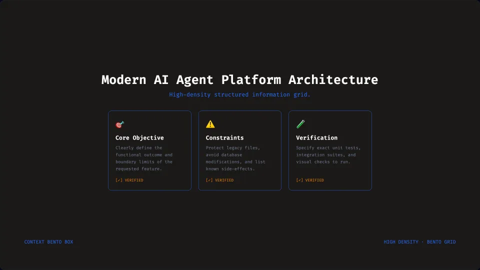

*   **Design DNA Tokens**:
    *   **Canvas**: Deep, dark lacquer black or dark stone (`#1c1917` or `#111c24`).
    *   **Ink**: Stone grays, with warm amber (`#d97706`), cobalt blue (`#2563eb`), and emerald (`#16a34a`).
    *   **Accent**: Thin, elegant rounded borders with generous padding.
    *   **Typography**: Clean sans-serif paired with light monospace.

---

### Style 16: Debug Reaction Board
*A developer's diagnostic board or Kanban board with reaction markers. Shows a system actively self-checking, tagging risks, and making uncertainty visible.*
*   **Topic**: *Microservices Health Self-Check*

  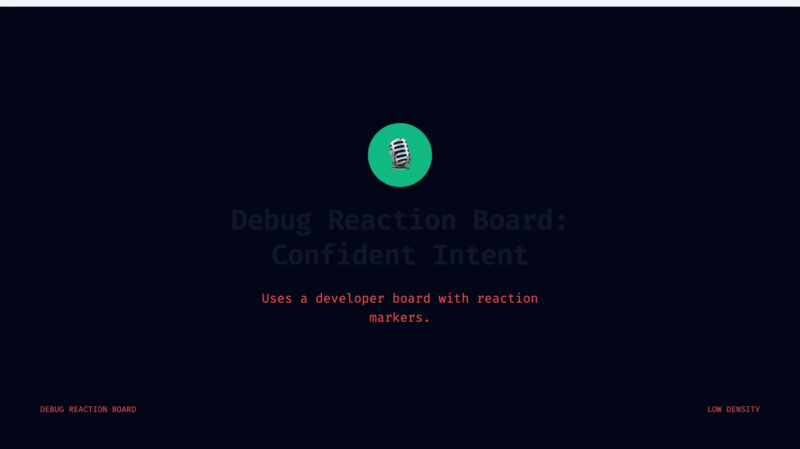
  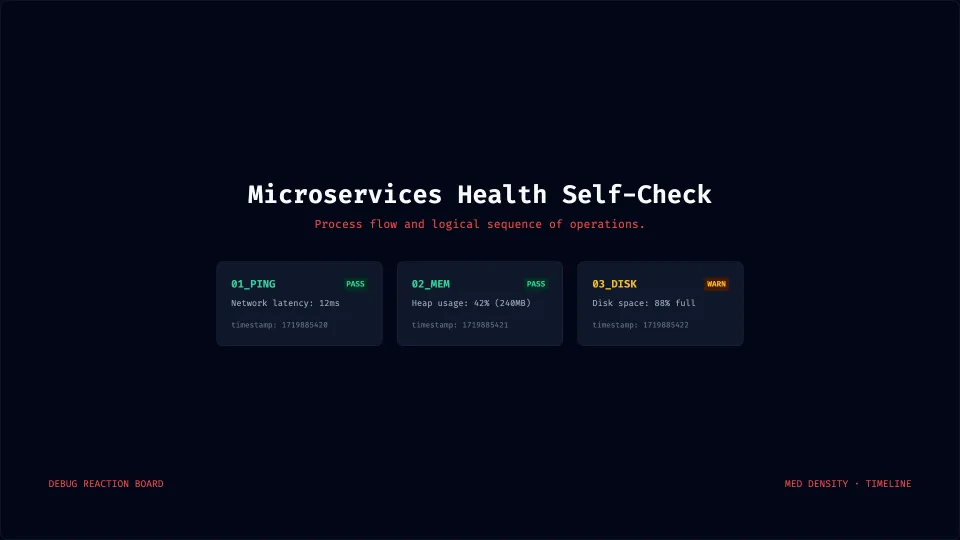
  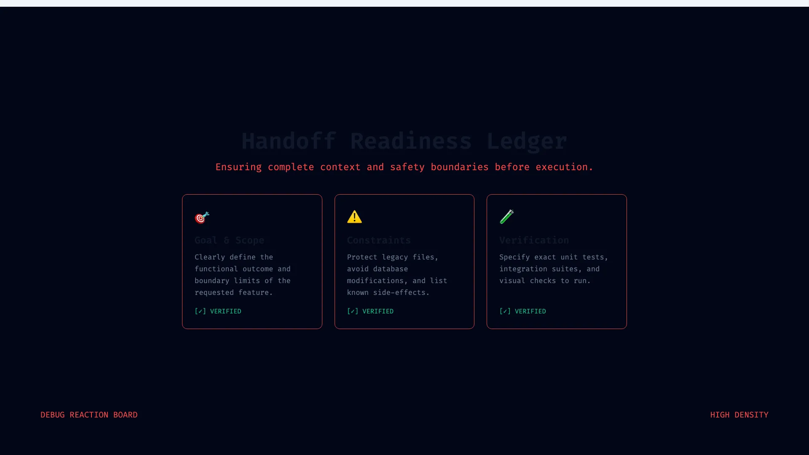

*   **Design DNA Tokens**:
    *   **Canvas**: Deep, dark IDE slate (`#020617` or `#0f172a`).
    *   **Ink**: Dark slate panels, with success green (`#10b981`), warning yellow (`#f59e0b`), and risk red (`#ef4444`).
    *   **Accent**: Glowing neon status badges and reaction markers.
    *   **Typography**: Monospaced terminal fonts (e.g., Fira Code).

---

## 🔵 Text Report (Styles 17 - 24)

Text Report styles are self-contained, evidence-rich, and document-led. Best for asynchronous reviews, manuals, and deep-dive technical reports.

### Style 17: Research Memo
*A formal, authoritative research memo or executive brief. Highly structured, dense, and bilingual-friendly, prioritizing typographic elegance.*
*   **Topic**: *Impact of Latency on Mobile User Retention*

  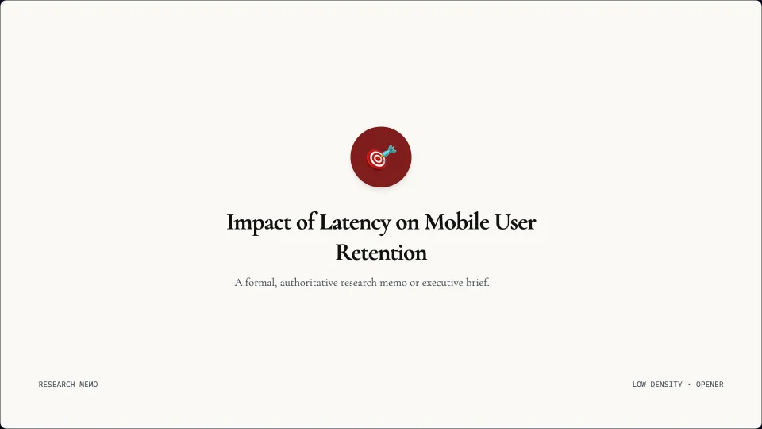
  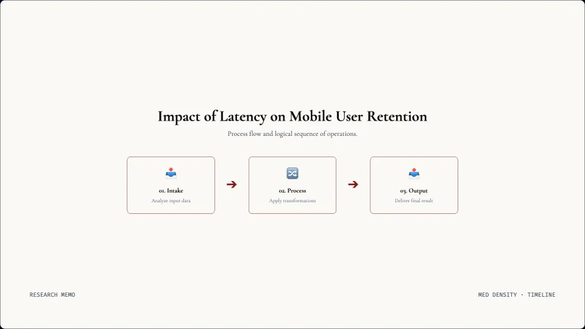
  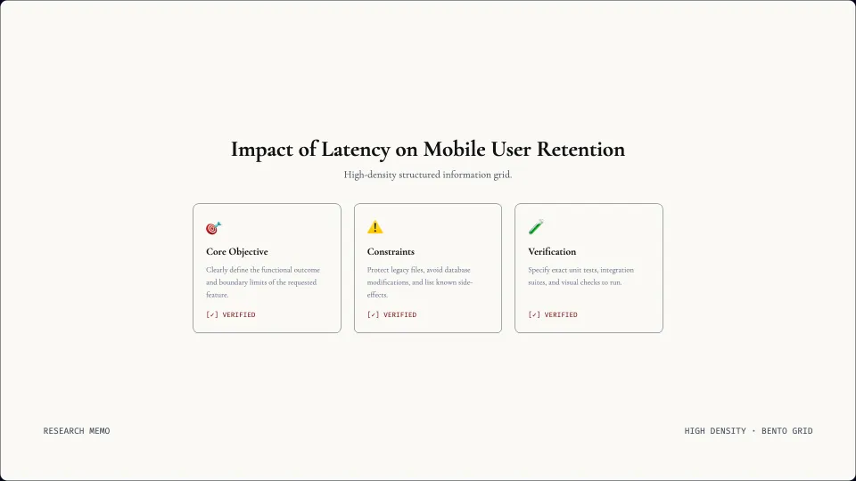

*   **Design DNA Tokens**:
    *   **Canvas**: Elegant, warm ivory paper (`#faf9f5` or `#fcfbf9`).
    *   **Ink**: Deep charcoal ink (`#111111` or `#1c1c1c`).
    *   **Accent**: Muted burgundy (`#7f1d1d`) or deep navy (`#1e3a8a`) for rule lines.
    *   **Typography**: Classical serif display (e.g., Cormorant Garamond) paired with highly legible body.

---

### Style 18: Maintainer Issue Brief
*A clean, structured developer issue, pull request, or ticket brief inspired by modern open-source issue trackers. Ideal for engineering audiences.*
*   **Topic**: *Post-Mortem: Connection Pool Exhaustion*

  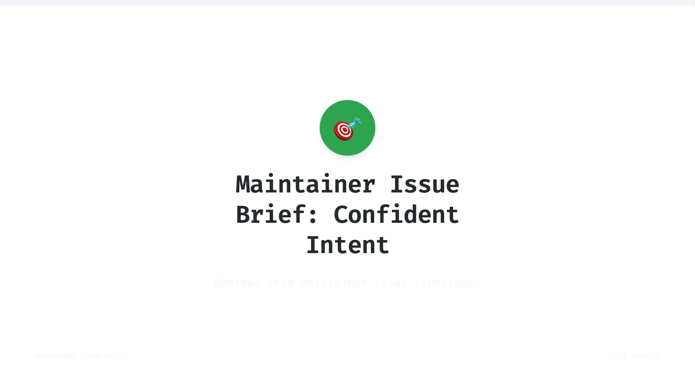
  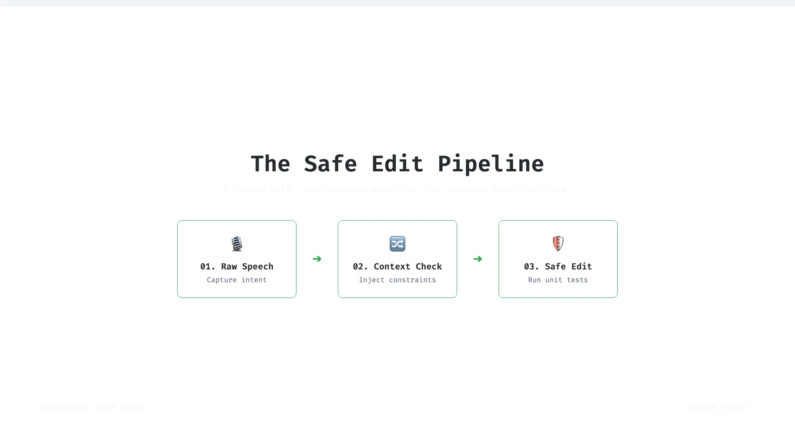
  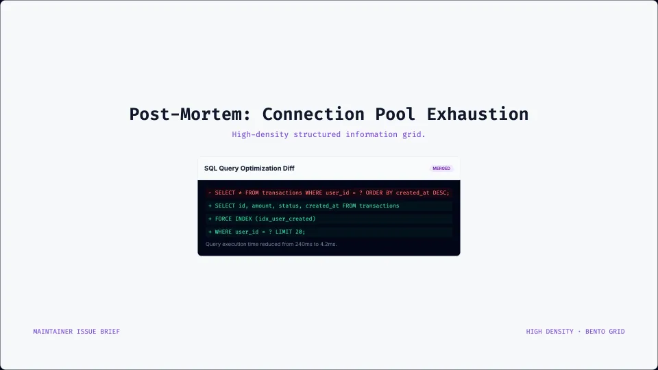

*   **Design DNA Tokens**:
    *   **Canvas**: Clean, light developer gray (`#f6f8fa` or `#f8fafc`).
    *   **Ink**: Deep charcoal (`#0f172a`), with light borders (`#d0d7de`).
    *   **Accent**: Issue status colors (open green `#1a7f37`, merged purple `#8250df`, closed red `#cf222e`).
    *   **Typography**: Clean sans-serif paired with monospace code blocks.

---

### Style 19: Decision Record (ADR)
*A formal Architecture Decision Record (ADR). Restrained, authoritative, and structured, focusing on context, decision, and consequences.*
*   **Topic**: *ADR 009: SQLite for Offline-First Sync*

  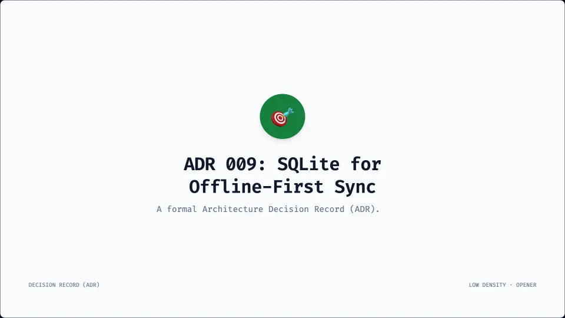
  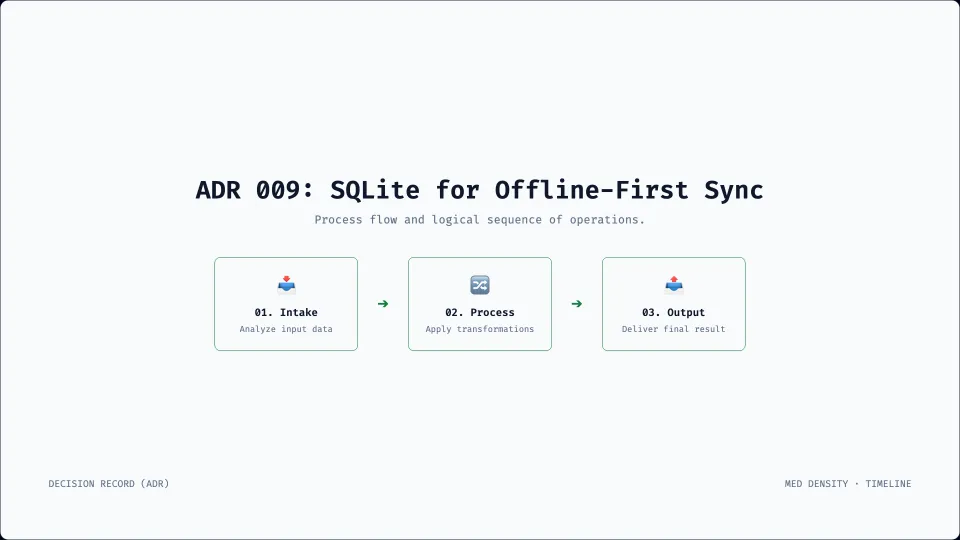
  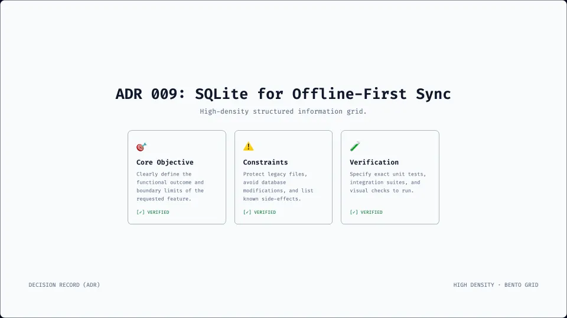

*   **Design DNA Tokens**:
    *   **Canvas**: Light, clean administrative gray (`#f8fafc`).
    *   **Ink**: Dark slate (`#0f172a`) for text, with thin, neat borders (`#e2e8f0`).
    *   **Accent**: Soft green for accepted status, amber for pending.
    *   **Typography**: Structured sans-serif with bold monospace metadata.

---

### Style 20: Benchmark Matrix
*A high-density technical comparison matrix or hardware benchmark. Highly structured, numeric, and precise, using clean grids and performance bars.*
*   **Topic**: *Edge LLM Performance Comparison*

  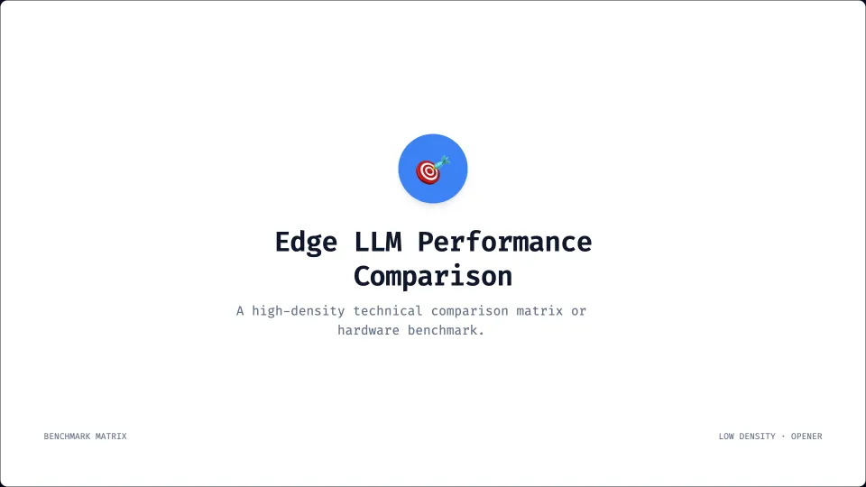
  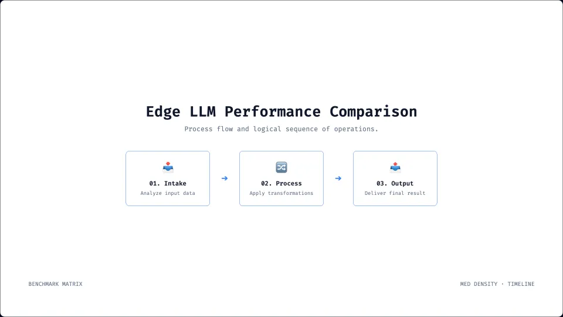
  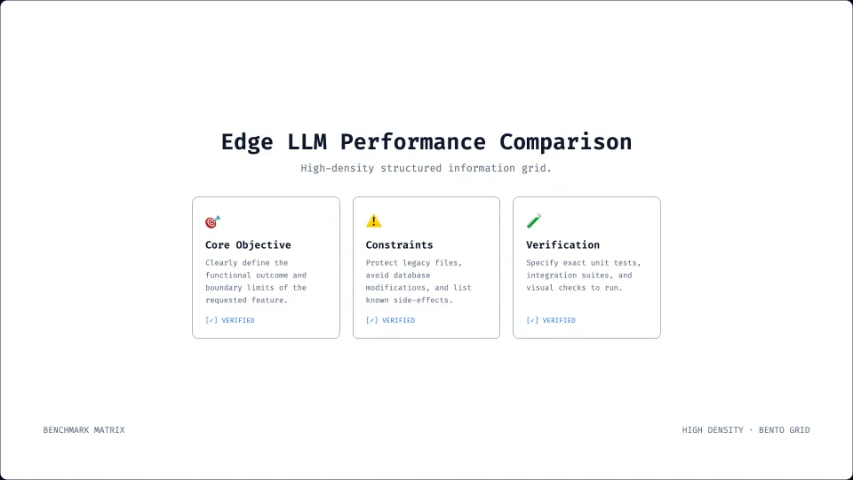

*   **Design DNA Tokens**:
    *   **Canvas**: Crisp white (`#ffffff`) or light gray (`#f1f5f9`).
    *   **Ink**: Deep slate (`#0f172a`), with thin gray gridlines (`#cbd5e1`).
    *   **Accent**: Performance bar colors (vibrant blue `#3b82f6` or emerald `#10b981`).
    *   **Typography**: Highly legible sans-serif with monospace numbers.

---

### Style 21: Field Notes Report
*A tactile, observational field notebook. Mimics a researcher's physical notebook with warm paper, charcoal ink, and polaroid-like card grids.*
*   **Topic**: *Smart Home UX Field Research*

  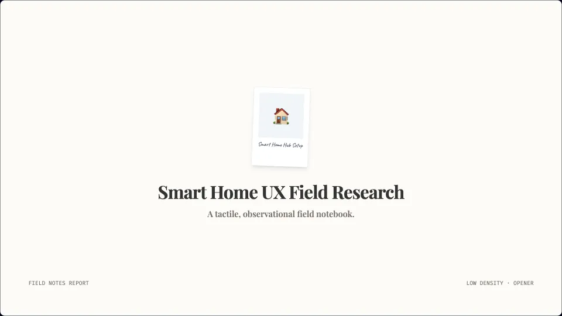
  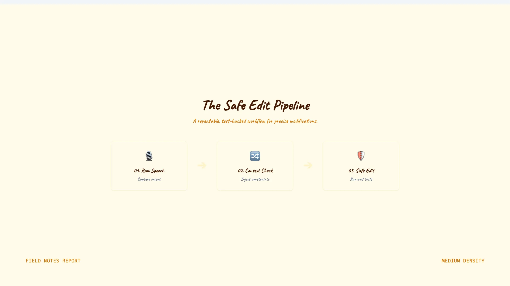
  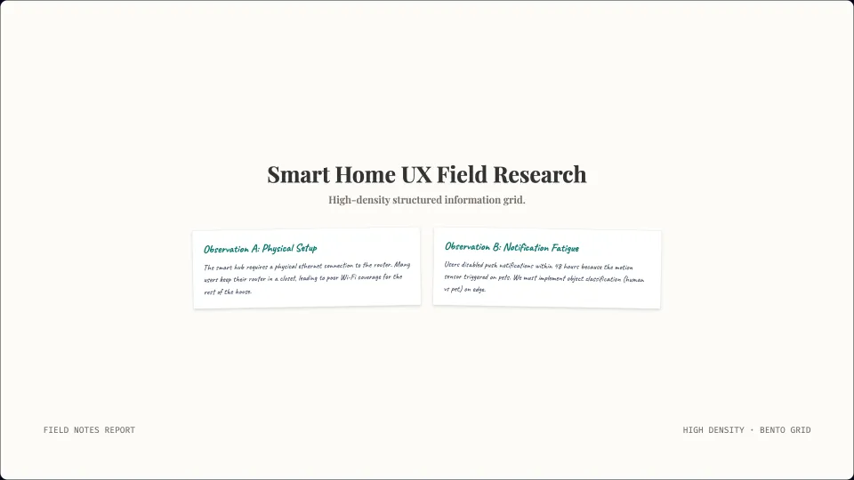

*   **Design DNA Tokens**:
    *   **Canvas**: Warm, textured ledger paper (`#fdfbf7` or `#faf6f0`).
    *   **Ink**: Charcoal gray (`#333333`), with soft, organic accent colors.
    *   **Accent**: Polaroid-like image cards and hand-drawn stars.
    *   **Typography**: Warm serif or elegant handwriting display paired with sans-serif body.

---

### Style 22: Operating Manual
*A compact, high-contrast industrial runbook, terminal guide, or operating manual. Turns complex processes into direct, actionable steps.*
*   **Topic**: *Database Connection Pool Recovery Runbook*

  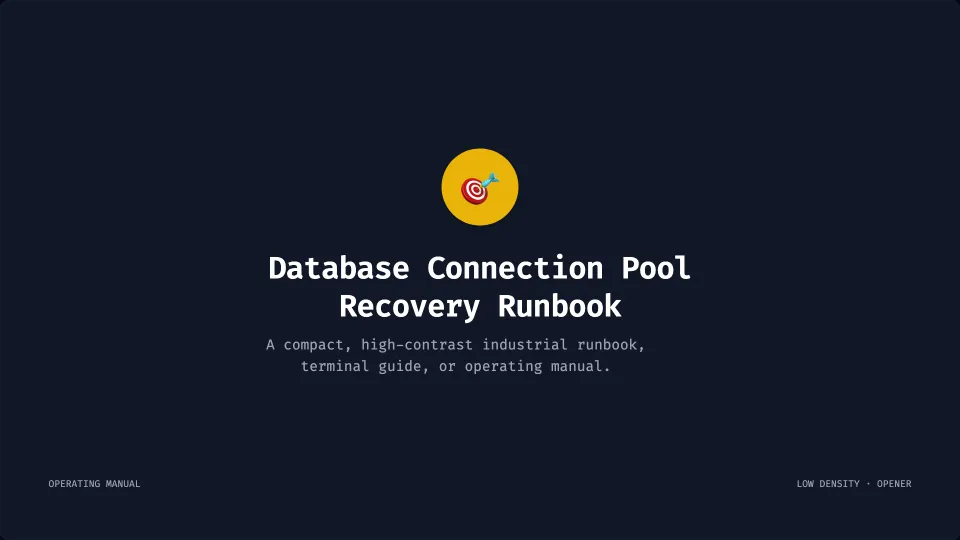
  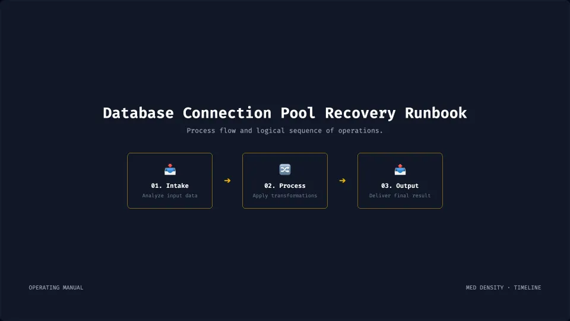
  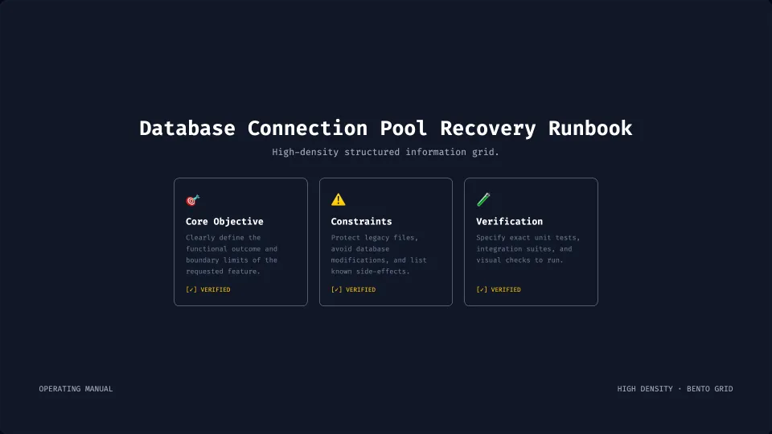

*   **Design DNA Tokens**:
    *   **Canvas**: Deep, industrial black (`#111827` or `#090d16`).
    *   **Ink**: High-visibility warning yellow (`#eab308`) and crisp white.
    *   **Accent**: Yellow-and-black striped warning headers.
    *   **Typography**: Bold, monospaced terminal fonts (e.g., Fira Code).

---

### Style 23: Checklist Ledger
*A plain, trustworthy financial or administrative ledger. Intentionally restrained and practical, focusing entirely on completeness and readiness checks.*
*   **Topic**: *Production Handoff Readiness Checklist*

  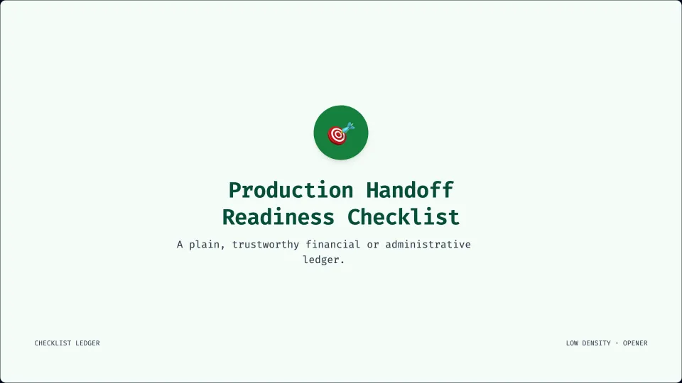
  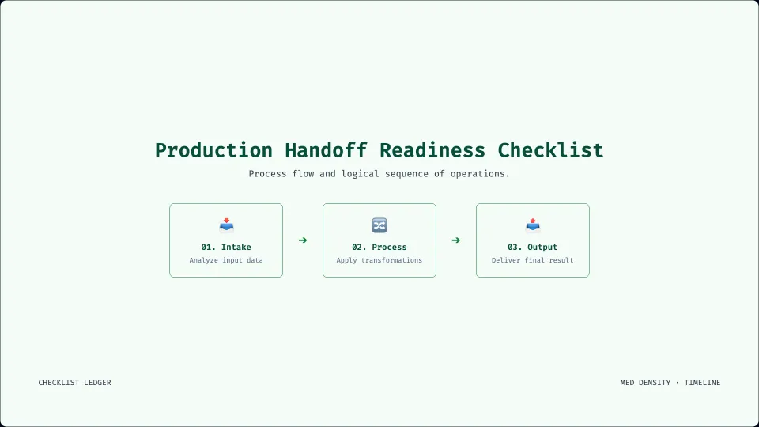
  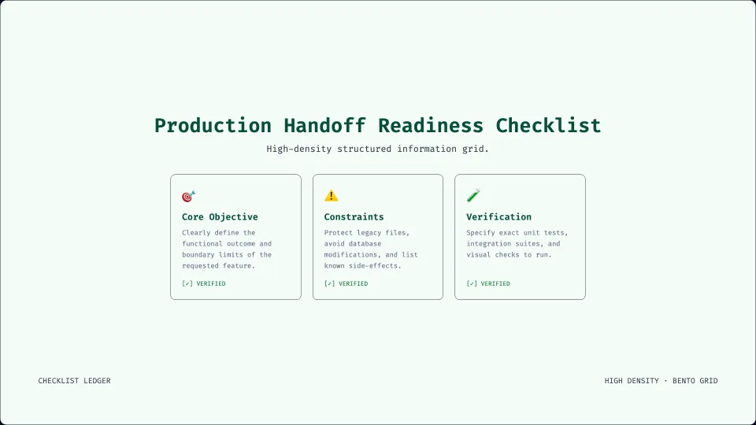

*   **Design DNA Tokens**:
    *   **Canvas**: Very light, clean mint green (`#f4fbf7`) with horizontal ledger lines.
    *   **Ink**: Deep forest green (`#064e3b`) for text, with bright green (`#15803d`) for checkmarks.
    *   **Accent**: Clean checkboxes and ledger-paper borders.
    *   **Typography**: Clean, traditional sans-serif or light serif.

---

### Style 24: Annotated Source & Diff
*A high-fidelity code diff, source code reviewer, or text annotator. Explains value by showing "before" and "after" transformations in a single view.*
*   **Topic**: *SQL Query Optimization Diff*

  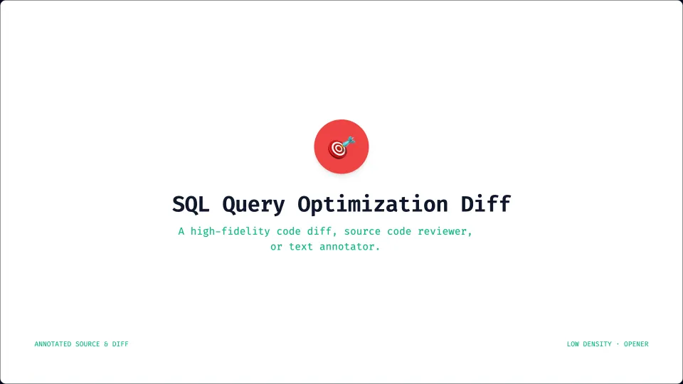
  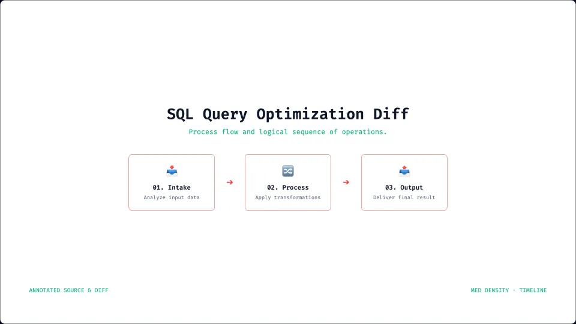
  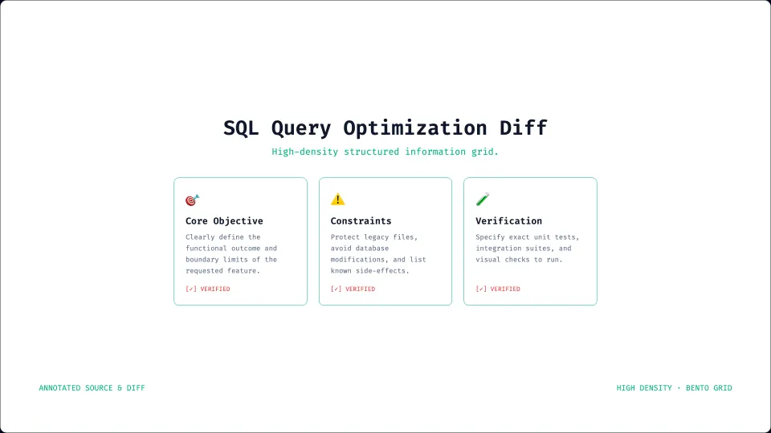

*   **Design DNA Tokens**:
    *   **Canvas**: Pure white (`#ffffff`) or light gray, with soft, tinted highlights (red `#fee2e2`, green `#dcfce7`).
    *   **Ink**: Deep charcoal (`#0f172a`), with bright red (`#ef4444`) and emerald green (`#10b981`).
    *   **Accent**: Hand-drawn circles, arrows, and annotation cards.
    *   **Typography**: Sharp, clean monospace for source text, sans-serif for annotations.
